1. Axios is a promise-based HTTP Client for node.js and the browser. It is isomorphic (= it can run in the browser and node.js with the same codebase). On the server-side it uses the native node.js http module, while on the client (browser) it uses XMLHttpRequests.

`Q) But, if under the hood axios uses XMLHttpRequest then how it can be promise based? because XMLHttpRequest uses callback❓`
🔧 How Axios wraps XMLHttpRequest with Promises
Axios internally wraps XMLHttpRequest in a JavaScript Promise. Here's how it works conceptually:
✅ Axios's job is to:
- Use XMLHttpRequest to make a request (on the browser).
- Set up event listeners (like onload, onerror, etc.).
- Resolve or reject a Promise based on the response.

🧠Conceptual Example:
```
function customAxios(config) {
  return new Promise((resolve, reject) => {
    const xhr = new XMLHttpRequest();
    xhr.open(config.method, config.url);

    xhr.onload = function () {
      if (xhr.status >= 200 && xhr.status < 300) {
        resolve({
          data: JSON.parse(xhr.responseText),
          status: xhr.status,
          statusText: xhr.statusText,
          headers: xhr.getAllResponseHeaders(),
        });
      } else {
        reject(new Error(`Request failed with status ${xhr.status}`));
      }
    };

    xhr.onerror = function () {
      reject(new Error('Network error'));
    };

    xhr.send(config.data || null);
  });
}


customAxios({ method: 'GET', url: 'https://api.example.com' })
  .then(response => console.log(response.data))
  .catch(error => console.error(error));
```

This is one of the reasons Axios is popular — it hides complexity and gives a cleaner API.


2. In case of Axios we don't need to parse the response using JSON for getting actual data while in case of fetchAPI we need to do this.

3. React query have different things like, AutoRetry mechanism, handle loading and error states automatically using hooks etc. While if we want to execute this things using axios then we need to execute these things manually.

==Note== - Read the some main features of react-query like Parallel-queries, Paginated-query, caching, retry. We can also implement these things by manually by ownself also.

4. React-query divides the API call into two category i.e. Query and Mutations and this is a prog term not just related to react-query.

`Query -`
a) Read/fetch.
b) Cache-able.

`Mutations -` 
a) Delete/Update/Create
b) Used in  api calls that make changes to B/E.
c) Useful in Optimistic update. 
d) No-cacheing.


5. Component folder - Contains the UIs code.
6. Services folder - Contains the logic of any kind of data fetching or mutations.
7. Helper/Utility folder - Contains the constants.

8. 🧠`Infinite Scroll`: In infinite scrolling if we add elements more n more as we scroll-up so, by this DOM becomes heavy and if dom tree starts becoming heavy then it will take more memory of RAM which can cause a performance issue.

So, the solution is ==List-Virtualization== where we just creates fix set of nodes and store data into those nodes only which are inside the window's screen and then when new data gets donloaded then we just shifts the data instead of creating new node. So, the DOM doesn't get any new or extra memory space.
And here when we scroll-down then we again downloads the data and shifts it similarly or we can also cache it.

9. `Tip`:We can implement list virtualization by ourself or can use packages.
Sometimes it's important to know the concept and it's working and use any package of it. Becoz it is not neccessary to implement everything by your own Instead just know that Where to use? and How to use? bcoz at the end it is somewhere a DSA logic.

###### TASK📝
Implement or use any React list virtualization package and create pinterest like thing.

==<u>**DATE: 6/8/25**</u>==

11. We can use either fetch or axios in React-query.

12. In react-query when we fetch data of any query-key then that data gets store inside cache and if within 5min we called another instance of same query key then the cache data gets updated. But, if we don't do another call within 5mins then the data from cache get collected by a garbage collector.

13. In React Query, when we fetch data using a query key, that data is cached.
If we call the same query key again within the cacheTime (default is 5 minutes, i.e., 1000 * 60 * 5), then:
✅ The cached data is used immediately.
✅ The background fetch (re-fetch) may or may not happen    depending on options like staleTime, refetchOnWindowFocus, etc.
If the query is inactive (i.e., not used in any component) for longer than cacheTime:
⛔️ The cached data is removed from memory by the Garbage Collector of React Query.
`Active Query` - A query that is currently mounted in some component.
`Inactive Query` -	A query that is not being used by any component right now.

14. A mounted component using useQuery keeps the query active. `Active queries are never garbage collected`, no matter how low the cacheTime is.
Therefore, reducing cacheTime on a mounted component will not trigger a new fetch or automatic deletion.

🧠`TIP` : Be capable of reading API docs.

15. For using react-query in our app we need to wrap our app component using queryClientProvider component.

16. Query also do optimistic update using cache.
17. How to write our own cache❓

###### TASK:📝
*Implement Infinite Scroll in coin list*

##### INR-USD updation of different component of a same page.

`Method-1`: Make a common global state variable in parent component and pass it as a prop to the required child.
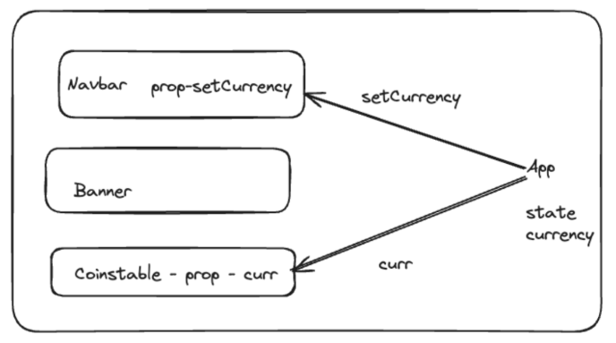
But, when the application become complex then passing out this props to lower level could be difficult because parent most(Global) component have their own things to manage.
Example:
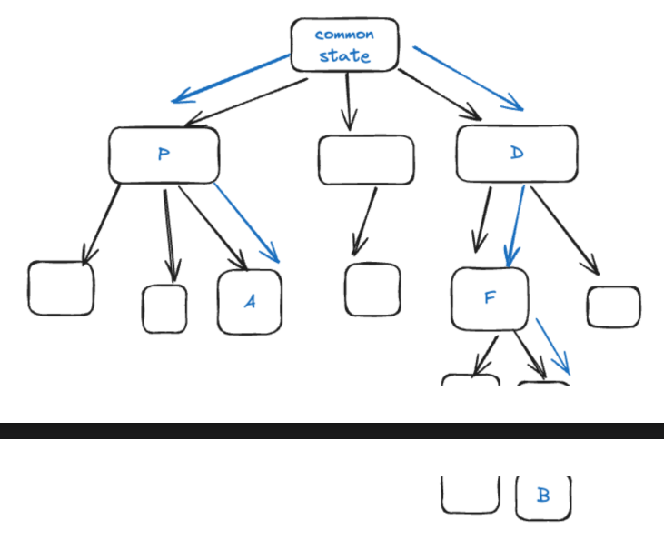
Here, we need to pass the state among whole chain and this is again a very `Big Problem` for code maintainability and etc. (==Prop-Drilling== ❓)

`Method-2`
We can reflect the update change of A-Comp into B-comp by returning callbacks to their parents. Like we have done during form submit in hangman game.
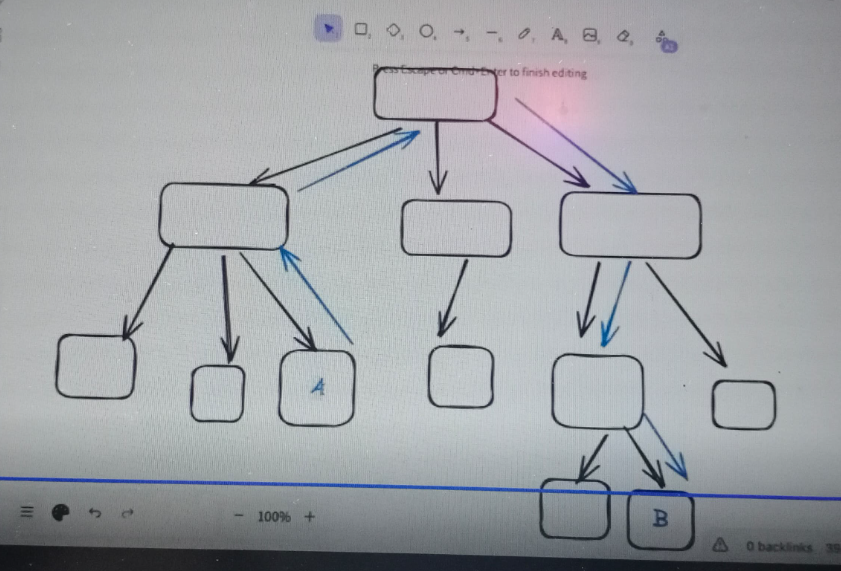
But this is also a to much call, and doesn't give us any simple solution for this it is complex to do in react.


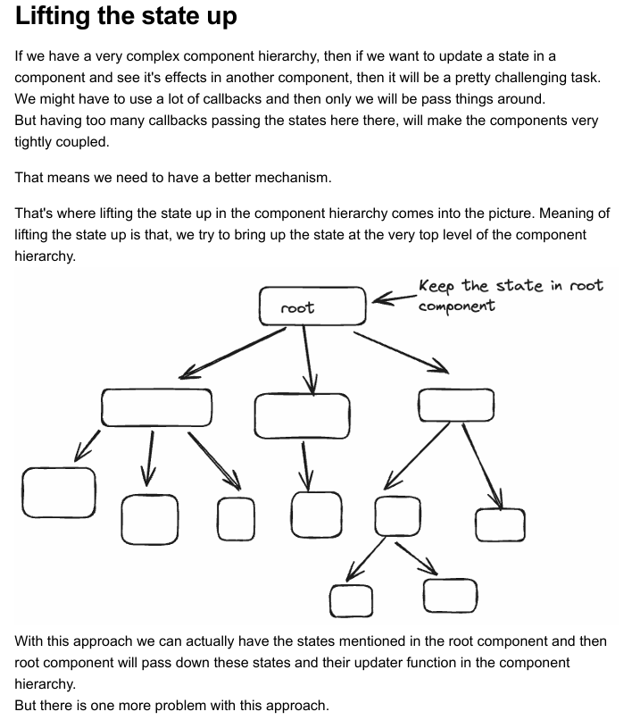
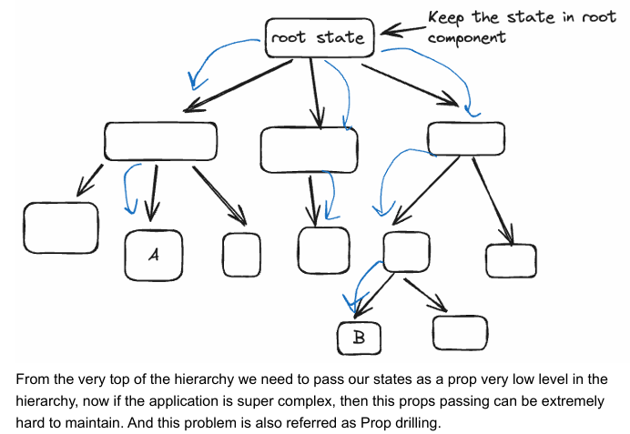

💡SOLUTION - Maintain the state at global store
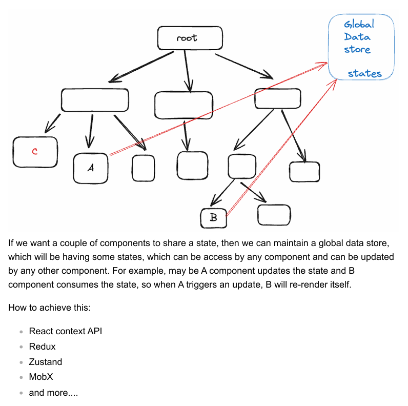

✅==React Context API== -: React from some of the latest versions, started supporting an in house solution for better `state management`. This is called as context API. Context api helps us to describe a state storage and then help us to access it from the component hierarchy without prop drilling.

- React gives us a `createContext()` function and this function returns an Context object.
```bash
import { createContext } from "react";
export const CurrencyContext= createContext();
```
- Context object gives a `provider component` and it is just like BrowserRouter of react-router thats why we need to wrap with it to the upper most parent component from where we want to use the state from, and due to which in the complete hierarchy of the parent component we can access the Context-Object.
- In the provider, we can add a value prop, which takes an object and inside this object we can store any state or functions, that we want to make accessible inside our Parent component(ex-HomePage)
```bash
<CurrencyContext.Provider value={{currency,setCurrency}}>
      <HomePage/>
</CurrencyContext.Provider>
```
- Child Comps don't need to pass props instead can use the global state using useContext(it returns value object of provider comp) hook.
```bash
function Navbar() {
 const { setCurrency } = useContext(CurrencyContext);
 return (
      <> 
        ....
      </>
 );
 }

```
- Context object gives us a provider comp as well as data store i.e context(value object for global state)
- We can also use multiple global context at diffrent levels by wrapping up the comps
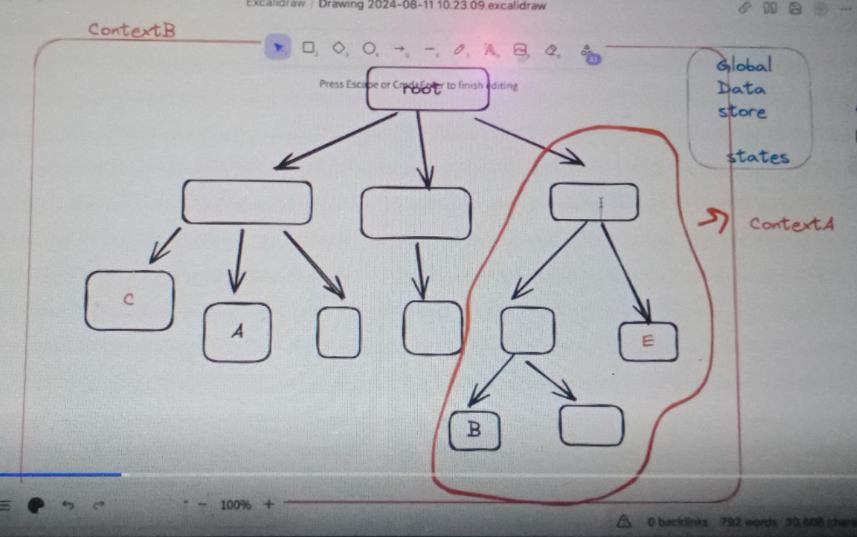

- ContextAPI is in-built in React not in ReactDOM only.

There are some disadvantages of contextAPI like in large complex project we need to do this wrap-up and 

✅Zustand:
a) It is a third-party state-management library.
b) It gives a create function with a set function as parameter for updating the states.
```
import { create } from 'zustand'

export const CurrencyStore = create((set) => ({
    currency: 'usd',
    setCurrency: (newCurrency) => {
        // console.log('Set function',set);
        
        return set((state) => ({
        ...state,
        currency: newCurrency
    }))}
}))
```
c) It is seamless, scalable, reusable, good docs, good integration with TS also.
d) It also has some advance concepts like middlewares etc.
https://zustand.docs.pmnd.rs/getting-started/introduction#installation

==TIP== : Make a habbit of reading Docs.

18. TS-Node -> ts-node is an npm package designed to simplify the execution of TypeScript code within the Node.js runtime environment. It functions as a TypeScript execution engine and a REPL (Read-Eval-Print Loop) for Node.js.
The primary purpose of ts-node is to eliminate the need for a separate, explicit compilation step from TypeScript to JavaScript before running your code. Instead, ts-node performs Just-In-Time (JIT) transformation of TypeScript into JavaScript, allowing you to directly execute .ts files using the node command.

19. When we execute our frontend code then all the third party libraries or dependencies are may or may not written in JS and it can be written in other language also like Java, TS or etc then how our code gets executed by NodeJS? Because we don't change that codes manually into JS.

20. SOLUTION - It is done by a Build
BUILD - Build is a process that internally use some kind of build tool that help us to compile the whole project which has multiple separated moudules, and if we will compile every single module individually then it will take lot of time to run the project. So, build tool simplifies this for us, it simplifies the dependency graph whatever modules need to be compiled first they automatically compile them step-by step and bring our project in a runable stage so that we can run it directly. 

21. ==Polyfills== : Polyfills are the custom implementation of browser's functionality. Bcoz it could be a case that their is a buggy/old browser which don't support some browser events so, in that case we need to implement it manually.
In interviews generally DOM, Array, Object related polyfills are asked to implement.

✅ getElementByClassName - Polyfill
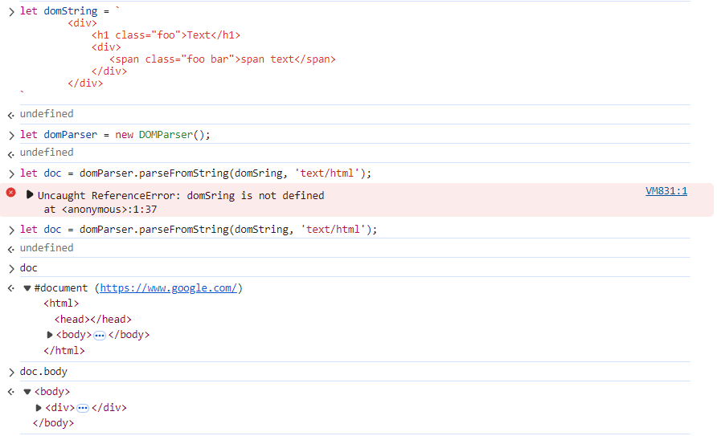
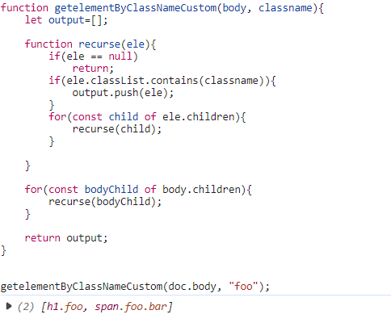

✅ getElementById - Polyfill
function getelementByIdCustom(body, idName){
    let output=[];

    function recurse(imdChild){
        if(imdChild==null) return;
        if(imdChild.id == idName){
            output.push(imdChild);
        }
        for(const child of imdChild.children){
            recurse(child);
        }
    }
    for(const imdChild of body.children){
        recurse(imdChild);
    }

    return output;    
}

let result = getelementByIdCustom(doc.body, "content");

✅ getElementByTagName - Polyfill
Just use `ele.tagname == tagname` inside recurse function

22. Learn about thisArgs. ❓
23. Deep-copy & shallow-copy❓
24. H/W - Make any app using these below APIs
https://github.com/public-apis/public-apis

25. useParams - It is a hook provided by react-router helps in taking out the value of variable from url.
```bash
<Route path="/posts/:postId" element={<Post />} />;

import { useParams } from "react-router";

export default function Post() {
  let params = useParams();
  return <h1>Post: {params.postId}</h1>;
}
```
Here ':' represents the dynamic part of url.

26. we should not use the shared layout in App.jsx because of separation of concern and for maintaining shared UI flexibility.
27. We can implement this share layout using <outlet/> component, provided by react-router. Here `<outlet/>` work as a placeholder for dynamic part of UI.
```bash
import React from 'react'
import Navbar from '../../Components/Navbar/Navbar'
import { Outlet } from 'react-router'

function MainLayout() {
    return (
        <>
            <Navbar />
            <Outlet />
        </>
    )
}

export default MainLayout
```
```bash
<Routes>
    <Route path="/" element={<MainLayout />}>
        <Route index element={<HomePage />} />
        <Route path="/details/:coinId" element=<CoinDetails />} />
    </Route>
</Routes>
```
Here the HomePage component also have '/' path same as MainLayout so for this case Route component provides a index prop which refers to the path of parent.

➡️Here path='/' of mainLayout tells that any url route which will start with '/' will contain MainLayout.
Can design other Layouts also like MainLayout like "/Admin" etc.
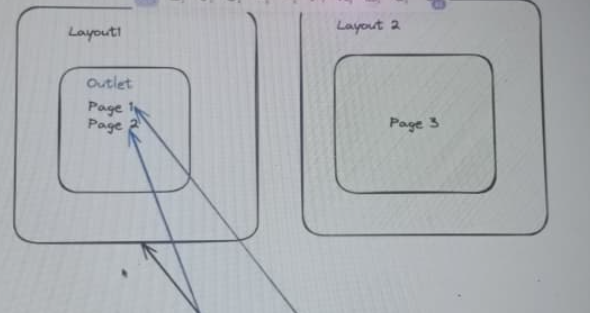


==DATE - 16/08/25==
###### Chrome Devtool (Initial Load Problem)
➡️Whenever we lands on a home or other page of a react application then after inspecting we can see source codes of that page inside source element.
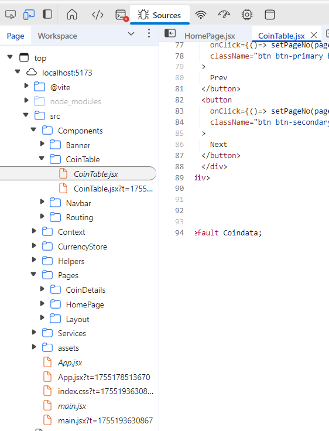
But, here we have landed on home page then why the coindetails page also get pre-loaded❓
So, there is two aspects of it
1) For : If All pages gets downloaded at start then user can easily navigate to other pages without any delay.
2) Against : If we pre-download all the web pages initially where user yet to go then it can increase the initial loading of our site.
Ex - BookMyshow(BMS) have 100s of pages & if it download all it's 100s of pages on initial load then there is a big network payload which we have to download & so it can hamper the initial load of BMS. And this is one of a big problems in frontend apps i.e initial load time.
So, now if we want to reduce the initial load time so that our user can land on our site as fast as possible so for that we need to Download the pages as less as possible on initial load.

How to handle this❓(till yet we are doing eager loading)
💡Sol - May be we can delay the downloading of pages other than home page on initial loading and then download the remaining ones as per the need. So, this is called Lazy Loading and its is a CS Concept not related to React only.
In CS whenever we want to delay some process to be execute after some time thats where Lazy Load comes into picture.

28. React auto provide the Lazy Loading function
```bash
import { Routes, Route } from "react-router";
import MainLayout from "../../Pages/Layout/MainLayout.jsx";
import { lazy } from 'react';

const HomePage = lazy(() => import("../../Pages/HomePage/HomePage"))
const CoinDetailsPage = lazy(() => import("../../Pages/CoinDetails/CoinDetails.jsx"))

function Routing() {
    return (
        <>
            <Routes>
                <Route path="/" element={<MainLayout />}>
                    <Route index element={<HomePage />} />
                    <Route path="/details/:coinId" element={<CoinDetailsPage />} />

                </Route>
            </Routes>
        </>
    )
}
export default Routing;
```
Now there is no any coinDetailsPage got downloaded when we land on home page
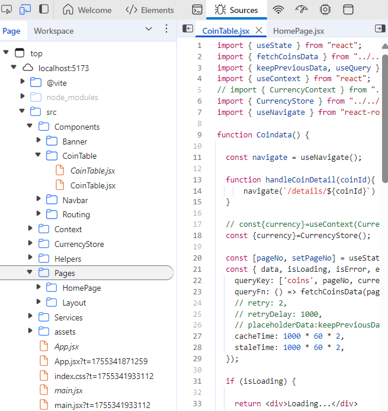
But then after clicking on perticular coin we navigated to the coindetails page and then that page gets downloaded.
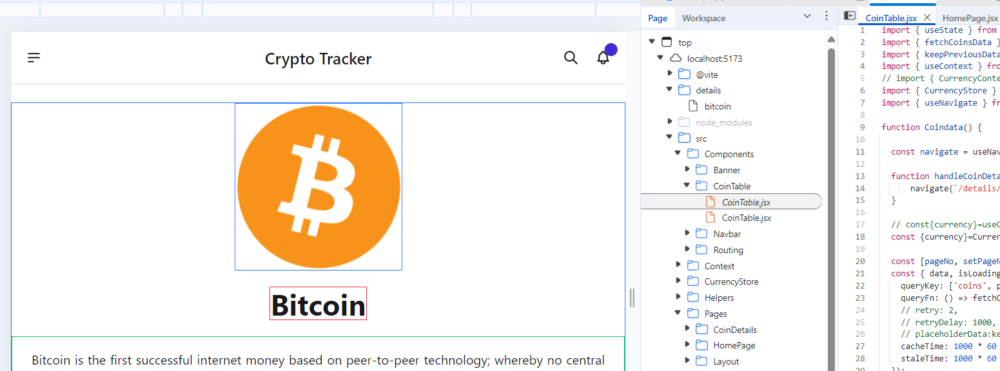
29. In our crypto code when we move from homePage to coinDetailsPage then here firstly coin details page get download from the Reactserver then the API call will be done but during that time of lazy loading what to show on UI❓. This is one problem for react.
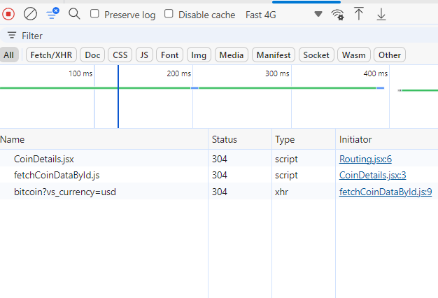
Real life Ex - Shopkeeper biscuit example
30. So for solving broken UI during navigation react provide ==React Suspense== for handling UI during the lazy loading time, Just like useQuery give us isLoading state. Suspense tells what to show on UI as an alternate using fallback prop till the time there is loading something
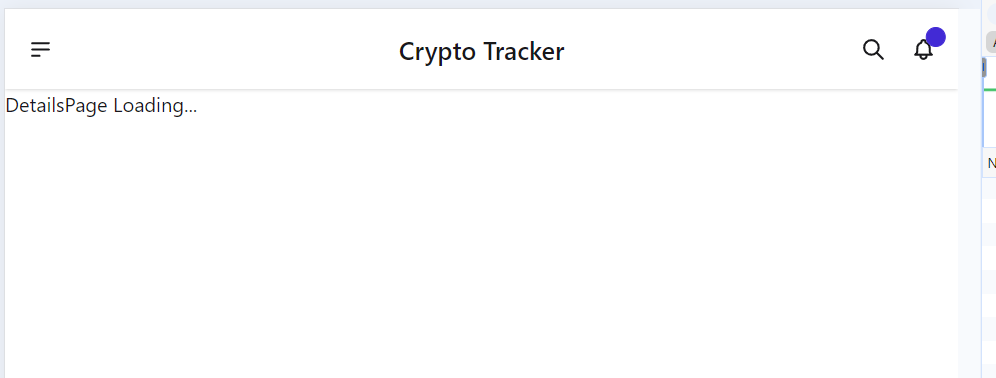
This is the fallback UI(DetailsPage Loading...) using Suspense.

This is Api calling handling using useQuery after the Coin-Details page got loaded.
31. 🧠SWR❓
32. We can also use components of ==react-content-loader package== as a fallback for showing fall back UI till the page is not downloaded.
33. We can also make our custom page loader components also.
import ContentLoader from 'react-content-loader';
```
function CustomPageLoader() {
return(

    <ContentLoader
    height={140}
    speed={1}
    backgroundColor={'#333'}
    foregroundColor={'#999'}
    viewBox="0 0 380 70"
    >
    {/* Only SVG shapes */}
    <rect x="0" y="0" rx="5" ry="5" width="70" height="70" />
    <rect x="80" y="17" rx="4" ry="4" width="300" height="13" />
    <rect x="80" y="40" rx="3" ry="3" width="250" height="10" />
  </ContentLoader>
)

}

export default CustomPageLoader;
```
34. We can also apply react content loader components during data fetching also.
```bash
 if (isLoading) {
    return (<BulletList />)
  }
```
35. If Any Comp we want to lazily load it then we can use react lazy function in it bcoz pages are somewhere also a component right.
36. This whole concept of downloading things separately whenever needed on page and component level using lazy loading is called code splitting.
37. We can add lazy & suspense to every comp of a page if required.